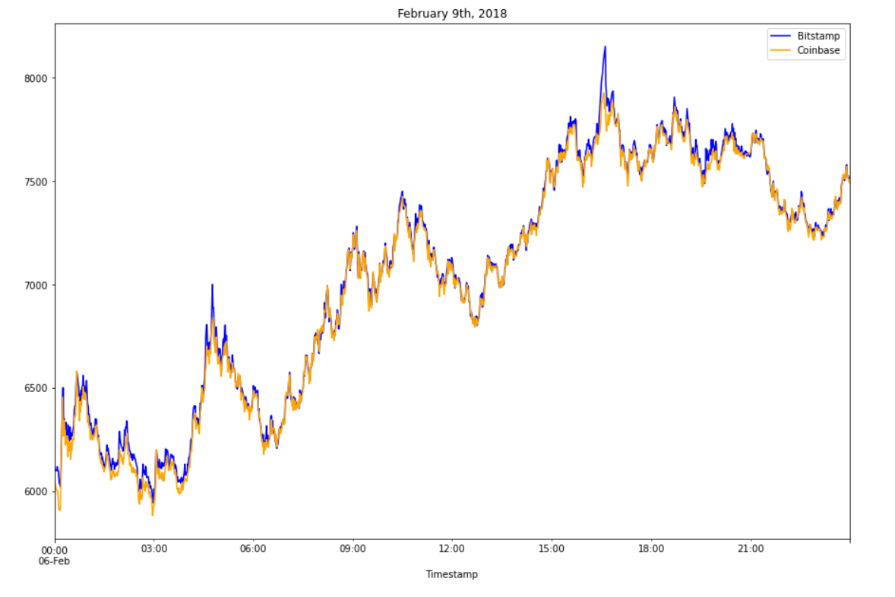

# Arbitrage Anaylsis

This notebook contains information about past arbitrage opportunities between the exchanges Coinbase and Bitstamp. The primary asset under analysis is Bitcoin. The following sections will contain a summarized analysis of the possible opportunities and profits found during certain dates.

---
 

## Libraries

The following libraries were used for this analysis:
* pandas
* matplotlib

---
 

## Data

Three months of data were analyzed with the following days chosen for analysis as they seem to be profitable compared to others days in their respective months:

January 28, 2018

February 9, 2018

March 14, 2018

For all three screenshots, the blue line represents Bitstamp, while the orange line represents Coinbase.

---
 

## Summary of Analysis

In the month of January, there were a fair amount of opportunities for arbitrage, but as time goes on, the amount of potential trades began to diminish, ultimately having extremely few opportunities for arbitrage.

 

More info can be found within the [notebook](crypto_arbitrage.ipynb) file in this repository.